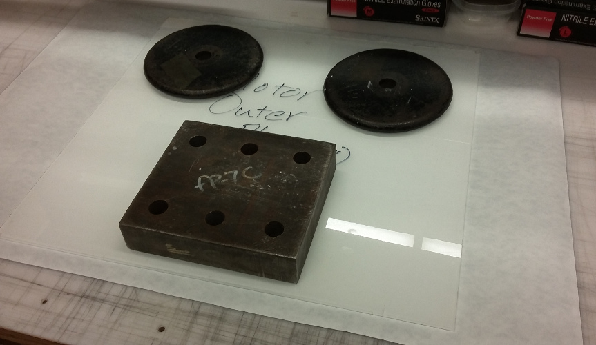
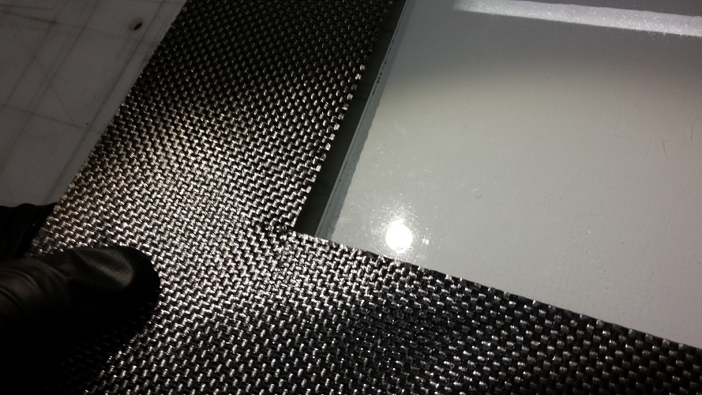
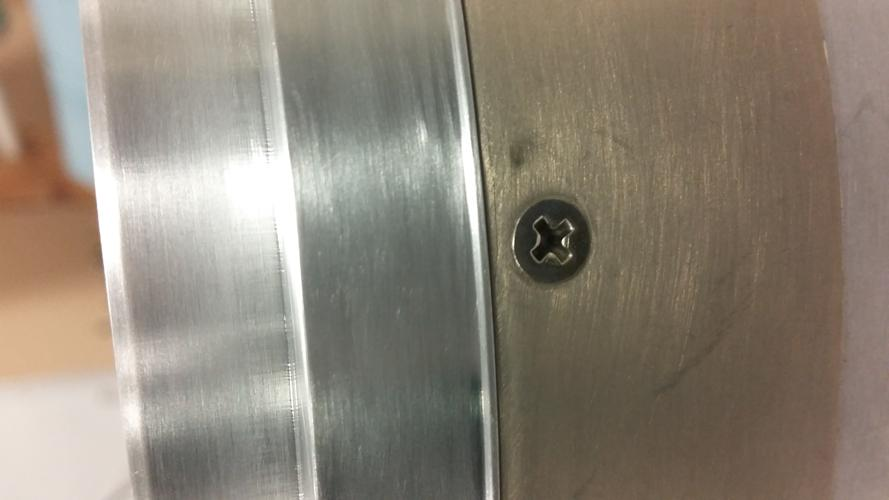
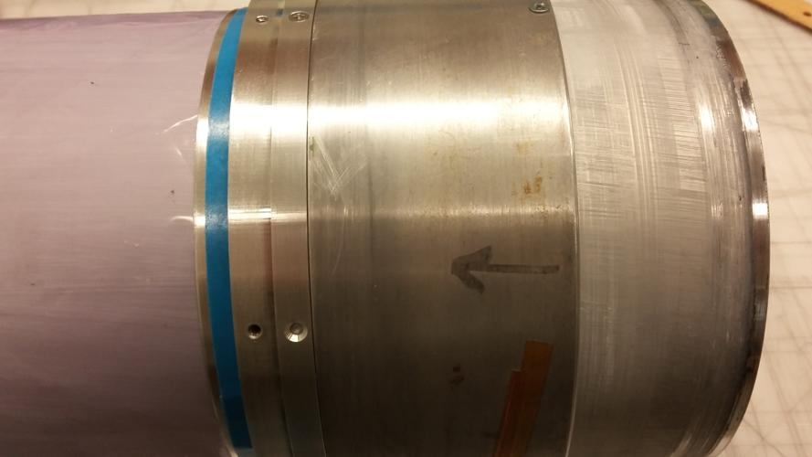
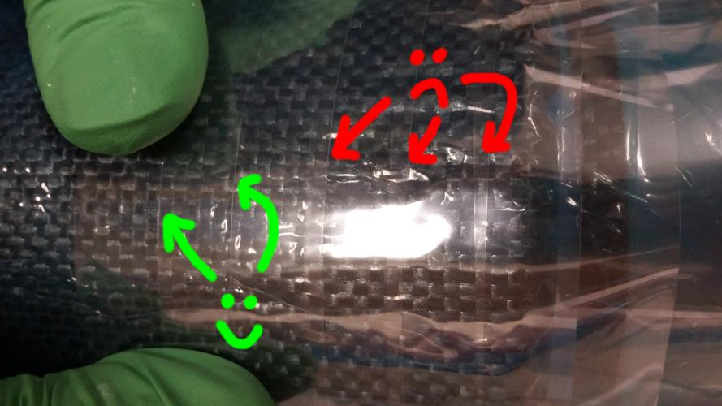
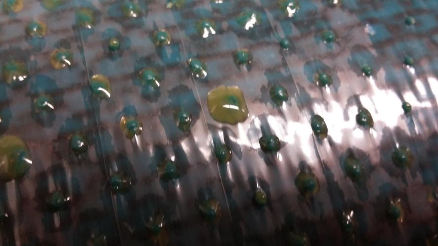
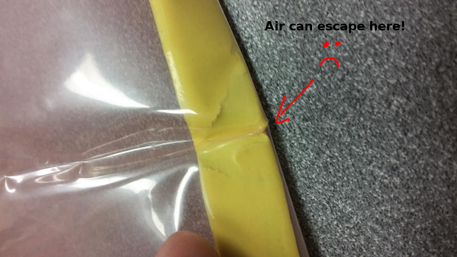
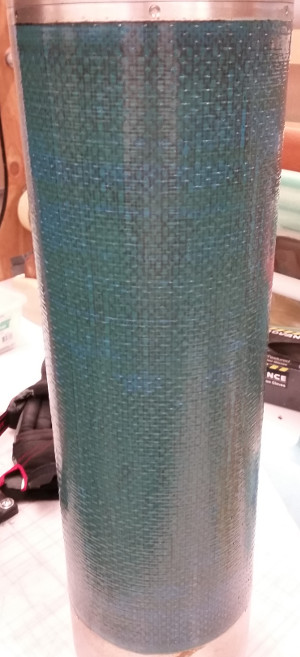

# Introduction
This is the procedure to make a cylindrical module. If you find any steps which are unclear, erroneous, unnecessary, or need improvement, please [add an issue for it on this repo](https://github.com/psas/lv3.0-airframe/issues). 

This procedure takes about 5 hours, if you have 3 people working on it, not counting the 5 hour cure cycle. If you're following this procedure for the first time, it's probably going to be closer to 7 or 8 hours. If you *really* know what you're doing, one person can do it, but it's not nice to make one person work for 10 hours straight. If you're trying modifications to this procedure, it's a good idea to do so on a smaller mandrel with no coupling rings, since that takes off a lot of the time. 

## Materials

### Consumables
1. [Orca skin](http://www.fiberlay.com/upload/techd-2522041-252204_OrcaSkin_Data.pdf)
1. [Orca seal](https://www.google.com/url?q=http://www.fiberlay.com/upload/techd-252203-252203_OrcaSeal_Data.pdf&sa=D&ust=1465469878478000&usg=AFQjCNHsERyZyLExl99CyF9hUNt7pAivVQ)
1. Shrink tape
1. Non-perforated release film
1. Vacuum bag sheets
1. Vacuum bagging tape ("goop tape")
1. Vacuum bagging breather material
1. 320 grit sandpaper
1. 600 grit sandpaper
1. 1500 grit sand paper
1. Acetone
1. Powderless nitrile gloves
1. A small piece of  acrylic (optional)
1. Paper towels
1. kapton tape or flash tape

### Layup Pieces
1. Prepreg carbon fiber (Satin weave is preferable. Anything but unidirectional will do. We use Cytec BMS 8-297 3K-70-PW TY4 CL2, which is the big yellow roll in the EB 480 freezer.)
1. Structural adhesive (We use Cytec's **Meltbond 1515**-3M, which bonds to CF, nomex, and aluminum. We know that 3M's AF-126 **DOES NOT WORK.**)
1. A male coupling ring (aluminum)
1. A female coupling ring
1. 1/4" thick overexpanded nomex honeycomb
1. A male dummy ring
1. A female dummy ring
1. An aluminum mandrel

### Tools
1. Vacuum pump (we use a venturi pump)
1. Air hose
1. Insulated gloves (gardening gloves will work)
1. Utility knife
1. Scissors
1. Mandrel-to-dummy ring screws (what size?)
1. Dummy ring-to-coupling ring screws (what size?)

# Preparation

All of these steps can be done in parallel. If you have the space and people, you should do them in parallel. 

## Mandrel preparation

In the figure below is shown the waxed mandrel along with a container of Orca Skin, and Orca Wax.

1. Use a piece of acrylic or a popsicle stick to scrape away any chunks of epoxy or adhesive from the previous layup
1. Wet sand with 320 grit paper, to remove the remaining epoxy and adhesive from the previous layup
1. Wet sand with 600 grit paper, removing the marks from the previous sanding
1. Wet sand with 1500 grit paper, removing the marks from the previous sanding 
1. Put on powderless nitrile gloves
1. Wipe with acetone and a paper towel until the towel comes back clean
1. Apply 2 coats of orca seal
1. Apply 7 coats of orca skin, 10 minutes between coats
1. Wait 1 hour

 

### Dummy ring preparation

1. Wet sand with 600 grit paper to remove any stray adhesive from the previous layup
1. Clean with acetone or water
1. Apply mold release to the female dummy ring
1. Apply a strip of kapton or flash tape to the female dummy ring, so that it overhangs the outside edge of the coupling end by 1 or 2 mm. 

## Coupling ring preparation

1. Place the mandrel on the mandrel-holder
1. Put on powderless nitrile gloves
1. Wet sand the adhering surfaces with 600 grit paper
1. Clean all surfaces with acetone
1. Continuously apply the anti-galvanic 3M-130 part A to the adhering surfaces for 3 minutes
1. Continuously apply the anti-galvanic 3M-130 part D to the adhering surfaces for 3 minutes
1. Take care not to touch the adhering surfaces from this point on
1. Apply 1 coat of orca seal to the innermost surface
1. Apply 3 coats of orca skin to the innermost surface, waiting 10 minutes between coats
1. Wait 1 hour

## Cutting films and fabrics
These steps are best done while you're waiting for the anti-galvanic juice to chooch and the final layer of mold release to dry.

1. Select the appropriate cutting template for the desired film or fabric
1. Lay the film or fabric over the plastic surface of the work bench
1. Place the template over the film or fabric
1. While one person moderately presses down on the template, another person should cut along the edges with a utility knife. It also works well to place weights on the templates while cutting, especially when cutting the adhesive.  
  
1. Lift up the outside portion of the cut before removing the template, to check that the cut is complete. If it isn't, slice the remaining material.  
  
1. Cut 1/4" x 20" strips of adhesive for each coupling ring. Make sure they are no wider than 1/4".
    1. This can easily be done by placing the edge of a template on a **straight-cut** piece of adhesive and using the depth gauge of a pair of calipers to tweak and check the width of a strip. 

When cutting the overexpanded nomex honeycomb core material, make sure the template is oriented correctly! The overexpanded cells only bend in one direction. Make sure the template is oriented so that the nomex will be able to bend around the cylinder. You should only be cutting single rows of cells (don't cross from one row to another).

To cut the carbon fiber, it works well the place the corner of the template on the corner of one of the cells (you'll have to remove one of the layers of peel ply). The template can then be rotated so that it perfectly lines up with the rows and columns of the fabric. This doesn't really work with fiberglass. 

# Assembly

These steps basically all have to be done in series. The layup table really only accommodates 2 or 3 people, so just switch out people as appropriate.  

## Layers

Shown below are two stages in the layup process. figure 2 shows the mandrel has been sanded and chemically treated. The first wrap around layer of release film has been added. In figure 3 below the first layer of carbon fiber has been added over the release film.

1. Put on *powderless* nitrile gloves
1. Screw the coupling rings into the dummy rings, puncturing the layer of tape applied to the female ring.  
  
1. Cover all the screw heads with kapton tape. This will prevent any epoxy or adhesive from flowing into them.
1. Without touching the molding surface of the mandrel, slide the ring assemblies on to the mandrel
1. Screw the dummy rings to the mandrel. It works best to place the mandrel upright, with one person sliding down the dummy+coupling ring from the top and another person fastening the screws. 
1. Place the mandrel back on the mandrel holder
1. Lay a layer of blue release film on the mandrel. It should span the entire molding surface of the mandrel and not overlap with the coupling rings. (This can be done by cutting the release film with the inner layer template and removing 3/4")

1. Lay the adhesive strips onto the lower adhering surface of each coupling ring. Make sure that the adhesive strips are no larger than 1/4". The extra 1/8" of flange is to prevent the adhesive from flowing onto the mandrel when hot.  
  
1. Lay the inner layer of carbon fiber onto the mandrel. It should overlap the adhesive strips completely, butting up flush against the step of the rings (see below). It should overlap itself by about an inch. Don’t worry too much about small wrinkles, they will be automatically smoothed during the cure cycle. Do not tug or pull on the CF in an attempt to remove wrinkles. If you need to remove large wrinkles, re-lay the CF instead.

1. Lay the inner adhesive layer over the carbon fiber. Rotating the mandrel while someone holds down the adhesive (wear powderless nitrile gloves) works well here.
1. Once the adhesive is well aligned, peel a section of it back. Someone should still be holding it down.
1. Roll the adhesive back down onto the carbon fiber
1. Roll back the remaining adhesive
1. Roll the adhesive film back onto the carbon fiber.
1. Use a heat gun to tack down the adhesive to the CF. You only need to get it hot enough to be glossy. Be careful not to adhere it to your gloves.
1. Lay the overexpanded nomex honeycomb core over the mandrel
1. Perform the same roll-back technique to adhere the nomex to the adhesive film
1. While rolling the nomex onto the adhesive it is helpful to use the low setting on a heat gun to assist the nomex in sticking and not unrolling.
1. Scrunch the overlapping portion of the nomex, so that it sits flat on the cylinder
1. Use a heat gun to warm the adhesive below the nomex and then firmly press the nomex into the adhesive. Be careful not to overheat the nomex. If it starts to noticeably warp, it’s warm enough. If it starts to darken, you got it too hot.
1. Use the roll technique to adhere the outer layer of adhesive film to the nomex. Be careful not to have any adhesive extending over the lip of the male ring. If it is, the female dummy ring will adhere to the male ring. If this happens, they are very difficult to separate.
1. Tack the adhesive down to the nomex with a heat gun.
1. Use the roll technique to apply the outer layer of carbon fiber to the outer layer of adhesive film. There should be about an inch of overlap between the carbon fiber and itself. Take care not to tug on the carbon fiber. The shrink tape will remove any wrinkles better than you can. Take care that the CF does not extend over the lip of the male ring.
1. If you’re making an adhesive surfaced module, add another layer of adhesive to the outside of the module. Take care that it does not extend over the lip of the male ring.

## Shrink Tape

1. If you're using shrink tape with no built-in release compound:
    1. Cover the layup in a layer of release film, enough to overlap itself and the coupling rings by at least 1/2". If you don't do this, the shrink tape will bond to the outer layer, making removal and sanding basically impossible.   
    1. Tape-down that layer with some kapton at the ends and in the middle.   
    Note: It may work better to use peel-ply instead of release film for this step. It's worth investigating.
1. Arrange the shrink tape on a spool so that the outer surface may be easily applied to the layup. (underhand from the spool; overhand onto the layup)
1. Set up a lamp, illuminating the layup.
1. Use kapton or flash tape to fix the shrink tape onto one of the dummy rings. Use lots of tape to fix it in place. If it comes loose, the layup will be ruined.
1. Use your dominant hand to tension the shrink tape against the layup.
1. Use your off hand to rotate the layup, wrapping the shrink tape around it.
1. Adjust the position of your dominant hand so that each turn of the shrink tape overlaps the previous one by 50%. This should result in the appearance that the surface is covered in a single sheet of double-thick shrink tape. If there are any gaps or triple-overlaps, you must roll the layup backwards and redo those sections. Such defects will become ribbing in the final module.  
  
  
1. Every 3 or 4 rotations, add a piece of kapton or flash tape to save your progress. Adjust the positions of the lamp and tape spool to your convenience as you go.  
  
1. When you reach the end of the opposite dummy ring, cut the shrink tape and securely fix it to the dummy ring using kapton or flash tape.
1. Add 3 strips of kapton or flash tape spanning the entire length of the module to fix the shrink tape against nudges during the vacuum bagging process.
1. If you are using perforated shrink tape, add a layer of non-perforated release film to the outside of the layup, using kapton or flash tape to hold it in place.1. If you don't do this, the module will end up with "goosebumps," which make the shrink tape much harder to remove and the module much harder to sand.  
     

## Vacuum bagging

After adding the final layer of release film, the layup is ready to be vacuum bagged. Figure A4 shows the layup wrapped in it’s final layer of release film.

1. Lay the breather material (“diaper”) over the mandrel
1. Secure the breather material with either kapton tape or flash tape
1. Form a 7 inch diameter tube of vacuum bag material by joining a sheet of it along one edge using the yellow vacuum bag tape (“goop tape”). This tube should be at least 1.5 feet longer than the mandrel.
1. Gently pinch any air channels out of the goop tape
1. Form a 7 inch diameter tube using the same method
1. Stand the mandrel upright
1. Slide the larger tube over the mandrel
1. Slide the smaller tube into the mandrel
1. Place the mandrel on its side, on the plastic surface of the work bench
1. Adjust the bags so that they are centered around the mandrel
1. Using the goop tape, seal one end of the inner tube to the corresponding end of the outer tube
1. Take care that there is no air channel formed by the overlap of the outer tube with itself. Everybody makes this mistake at least once.
1. Gently pinch any air bubbles or air channels out of the goop tape
1. Cover the end of the vacuum hose with diaper, securing it with kapton or flash tape
1. Place the diaper end of the vacuum hose onto the dummy ring near the open end of the bag
1. Tape down the hose using kapton or flash tape
1. Carefully apply goop tape to the vacuum hose, so that it may seal to the tubes
1. Carefully apply a ring of goop tape to the inner surface of the outer tube
1. Seal the inner and outer tubes to each other
1. Gently pinch any air channels out of the goop tape, taking special care to make sure the hose and tubes form a complete seal. Make sure there is no air channel formed by the overlap of the outer tube with itself.  
  

# Curing

## Cooking
1. Set up the aluminum (not plastic) mandrel holders in the oven
1. Thread the vacuum hose through the hole in the oven wall
1. Gently place the mandrel on the aluminum mandrel holders in the oven, while someone holds them in place
1. Attach the outside end of the vacuum hose to the venturi pump
1. Attach the venturi pump to a compressed air supply
1. While slowly turning on the compressed air supply, check the bag for hissing (this indicates a leak which must be sealed with goop tape)
1. Turn the air supply on fully
1. Arrange the thermocouple to be directly underneath the mandrel, or inside of it
1. Close and latch the oven
1. Make sure the oven is plugged into two separate circuit breakers
1. Make sure both relays on the side of the oven are in the “on” position
1. Ramp up the the oven at 3°F per minute until it reaches 350°F
1. Place the snorkels/fume hoods above the oven, open all the doors of the room, and place a fan in at least one doorway
1. After it reaches 350°F, hold the oven at that temperature for two hours
1. Ramp down the oven temperature by 5°F per hour. Use the oven door to control this cooldown, opening it slightly for faster cooling.

## Removal from mandrel

1. Once the oven has reached 100°F, open the door and slide vacuum hose into the oven, through the hole in the oven wall, using insulated gloves
1. Remove the mandrel from the oven using insulated gloves and place it on the mandrel holders on the workbench
1. Cut open and dispose of the vacuum bag
1. Remove the hose, diaper, and release film from the mandrel and dispose of them
1. Unscrew the dummy rings from the mandrel
1. Place the layup vertically on the table and slide the module up. It should easily slide off. If it doesn’t wait until it cools to room temperature. If it still does not come loose:
    1. Place four mandrel removal blocks on the floor
    1. Place the mandrel in the blocks, using insulated gloves
    1. Place a piece of wood on the top of the mandrel
    1. Tap the piece of wood with a hammer to release the mandrel from the module
    1. With one person holding the mandrel with insulated gloves, gently pull and wiggle the module off the mandrel in the direction of the male ring. Take care not to damage the module or mandrel. If necessary, run cold water through the inside of the mandrel. This will thermally shrink the mandrel, allowing it to slide off easier.
    1. If the module remains stuck, place it on a piece of plywood with the removal blocks holding it up.
    1. Place the wooden plug inside the mandrel on top.
    1. Place a 2x4 on the plug
    1. Hammer on the 2x4 with a large weight (~50 lb) to slowly separate the mandrel and module. Stack chunks of 2x4 under the removal blocks to get more height.
    1. If you need to do this, you did something wrong with the mold release and/or release film.
1. Place the mandrel back on the mandrel holders on the workbench
1. Remove the blue perforated release film from the inside of the module

# Results

If done properly, this should result in a module with maybe a few thin creases from flaws in the shrink tape. Adhesive-surfaced modules should be finished with 600 and 1500 grit wet sanding. (do not submerge!)  
  

## TODO:
Documentation of the sanding should be added when it's actually been done.

Moon Tacos (Test)
