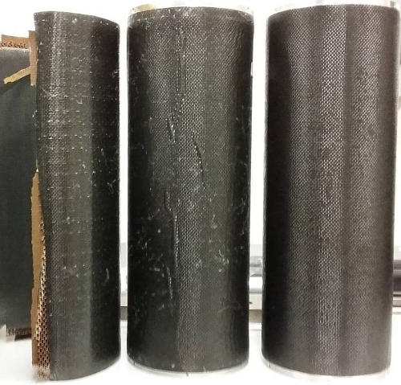

#LV3 news
* While reading through the "final book" from the 2014 capstone, we discovered that they switched from AF30 to AF191-M as their adhesive. They did this to get rid of wrinkles, which is the exact problem we're having with the AF30. So, we should be trying to obtain AF191-M. 
* The PDS update presentation and report also happened. 
* We purchased tubular vacuum bagging material from Revchem to use as the inner tube for our layups. We're still using a flat sheet to form the outer tube (not a big deal). 

###Layups
* Since Tuesday, we've done two more layups.
    * LU16.2 added a sheet of release film beneath the inner layer of CF, and used vacuum bagging. It came out with lots of heavy wrinkles and some delamination, also it's covered in breather fuzz. It left a lot of epoxy on the mandrel, but was removed by hand
    * LU16.3 used the extra release sheet, a heavier coat of mold release, and a caul plate. It came out with light wrinkles and a little more delamination, but no breather fuzz. It left almost no epoxy on the mandrel and came off by hand. This means we don't have to spend 2 hours sanding off epoxy for the next layup! So, thick coats of release agent are highly recommended. 

###advising from Boeing
* We had a teleconference with Sandie and Thomas from Boeing. Thomas works with high performance CF. For example, he makes CF helicopter blades. We wrote up a detailed procedure of how we did our layups and the results, which he is reviewing before giving us advice. 
* He highly recommends we get a vacuum gauge, so we know how strong of a vacuum we're pulling on the modules. 

#PSAS meeting
* We can have sponsors put stickers on the rocket. However, if they pay us to add stickers, they can't count it as a charitable donation. If they make a charitable donation, we only add stickers if we want to be nice.
* We got a couple of underclassmen, Marie and Chase, to handle building a temperature sensing module for LV3. This way, we can verify the predictions for the skin temperature of LV3 and give PSAS a warning system if the epoxy on the nose cone might be crossing its glass transition temperature. 
* Andrew re-sent the invitations to the PSAS Github group to the LV3 team members. As I said in an email, you guys need to follow the link in that invitation email and accept the invitation or log into the Github website and accept the invitation. After that, you should be able to edit the LV3 repo. 

###LV3 design
* I talked about the fin design with Erin, Jeremy, and Andrew. They pointed out a problem with the current fin design. When the rocket lands, the fin can always lands first. This means that if the fins are highly swept, the way we have them, there will be one fin taking the whole impact of the rocket landing. Additionally, since LV3 is a testing platform and not a performance platform, the few percent of altitude gain from the swept fins isn't worth the risk of damage. So, we need to redesign the fins to be closer to the trapezoids that LV2 has. 
    * Conveniently, MSC requested that we change the design of the fins to make them manufacturable.
* We also talked about the heating on the nose cone. 
    * Originally, we were planning on comparing the total drag and wave drag, in order to estimate the order of magnitude of the heating on the nose cone. However, the theoretical wave drag equations and the OR model for LV3 gave numbers that couldn't both be right. I also found that the drag coefficient as a function of Mach number for the LV3 OR model didn't look right. So, there's probably something wrong with the OR model.
    * Erin suggested trying JSBsim or RASAero, to get better estimates of drag near Mach 2. 
    * Failing that, we could do a CFD model. Kristen, from the liquid engine team offered some help, if we need to do CFD. 
    
###materials
* The LV3 and LV4 teams discussed contingencies, in case we don't get any more adhesive film. 
* **Important:** we are making [a comprehensive list of all the industry contacts](https://docs.google.com/a/pdx.edu/spreadsheets/d/1d2qun40fs4k9UVbh9HlHR21YOfi4GItysJQO7nBfzew/edit?usp=sharing) made by the LV3 and LV4 teams. Our shortage of adhesive film is a serious problem, so we need to make a coherent effort to obtain more. Everyone, please look over the list. If the information is not up to date, is incomplete, or is missing, please correct it. We really don't want to alienate potential donors with redundant requests or forget to call a potential donor.
* Apparently professors Wern and Yi both used to work in composites, so we should ask them if they could provide any industry contacts. 
