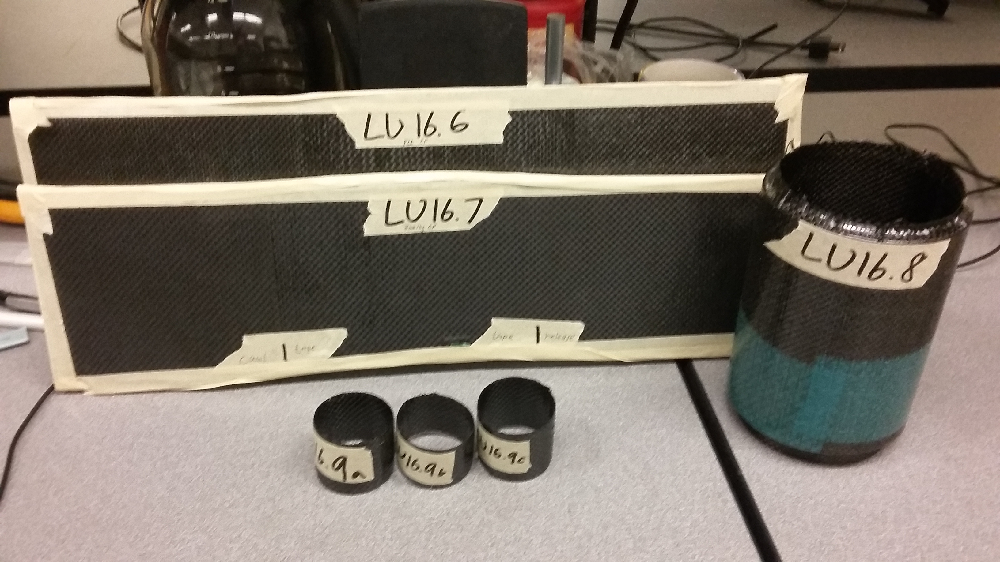

#LV3 update for 2016-4-12

##LV3 Capstone stuff
We need to give Etesami a list of:
* project title (more descriptive than LV3)
* short summary of the project
* a picture
We have our thing on June 2nd at 12:30. It should last about 10 minutes. 

##Layups
###LV3
Since the last update, we conducted some tests based on LV4's results (see below) with using the 1515 adhesive as a surface finish.
The tests consisted of:
*flat coupons using PCC's CF:
	*CF; release film; mold release; aluminum plate (for reference. same as LU16.3 and LU16.4)
	*CF; layer of shrink tape; release film; mold release; aluminum plate
	*CF; mold release; aluminum plate flat coupons using
* Boeing's CF:
	* CF; release film; mold release; aluminum plate
	* CF; layer of shrink tape; release film; mold release; aluminum plate
	* CF; mold release; aluminum plate
* mini cylinder with an adhesive coating on half and shrink tape on the whole thing (Boeing's CF)

The results were as follows:
* The shrink-taped mini tube was just as hard and smooth as the stuff from the last team. None of the people I had handle it could feel any delaminations. The adhesive-skinned portion is even better, and, as we saw from LV4's layup, may be sanded for an even better finish.
* The flat coupons are a little quirky. 
	*The tape surfacing didn't turn out well. The shrink tape shrunk... go figure. So, it got all wrinkly and transferred that to the CF. 
	* The release film surfacing was pretty much the same as the previous layups. 
	*The raw caul plate surfacing was very smooth where there was sufficient pressure. The adhesive leaked through the bottom layer of the flat PCC CF, which we'll need to consider for the fins.
	* The Boeing CF is a similar weave as the PCC, but has an even worse wetting problem. The adhesive doesn't leak through it though.

After that test, we added another layer of adhesive to the mini cylinder and put it through another cure cycle (hot enough for adhesive but cold enough for cured epoxy). 
The motivation behind this was because trying to sand down a single layer would most likely damage the fibers. On a full sized layup, this would be pretty much guaranteed. 
So, we now have samples of (everything shrink-taped):
* CF outer surface
* single layer adhesive surface
* double layer adhesive surface (due to overlap)
* CF surface with single layer post-cure adhesive surface
* single layer adhesive surface with single layer post-cure adhesive surface
* double layer adhesive surface with single layer post-cure adhesive surface
* CF surface with double layer post-cure adhesive surface (due to overlap)
* single layer adhesive surface with double layer post-cure adhesive surface

Long story short: we were too quick to abandon the tape method as too skill based / not repeatable enough. The shrink tape reduced a lot of the dry cell problem, but the adhesive completely eliminated it. 

###LV4

